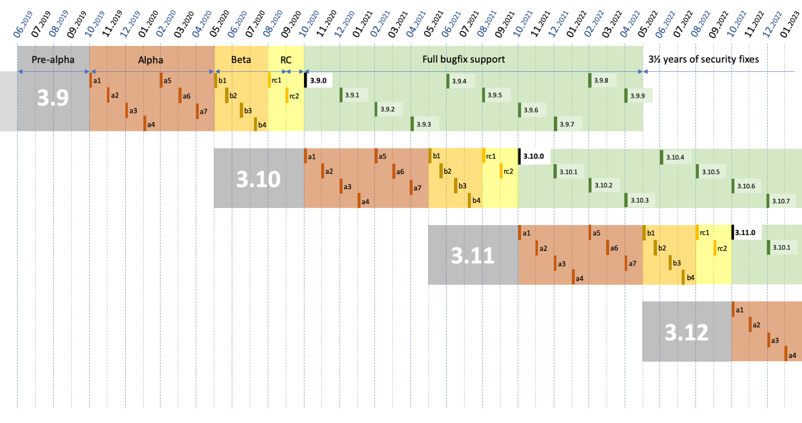

==========
Python 3.9
==========

28/08/2020
----------

+ Current status: 3.9.0 rc1
+ Final release: 2020-10-05
+ https://docs.python.org/3.9/whatsnew/3.9.html

----------
Vocabulary
----------

+ Python is the language, created in 1991 by Guido Van Rossum
+ CPython is the interpreter (a C program that executes Python code)

--------
Builtins
--------

+ No import needed

::

    % python
    >>> print([])

----------------
Standard library
----------------

+ Import needed

::

    % python
    >>> import datetime
    >>> datetime.date

----
PyPI
----

+ Automated installation from *pypi.python.org* with ``easy_install`` or ``pip``
+ API may change anytime

::

    % pip install numpy
    % python
    >>> import numpy
    >>> numpy.array

-----------------
Python 3.5 (2015)
-----------------

+ PEP 492: ``async`` and ``await`` are new keywords
+ PEP 465: ``@`` is new operator for matrix multiplication: ``a @ b`` (``__matmul__``)
+ PEP 484: new ``typing`` module

-----------------
Python 3.6 (2016)
-----------------

+ PEP 506: new ``secrets`` module
+ PEP 498: formatted string literals: ``f'Next year is {1 + today().year}'``
+ PEP 515: underscores in numeric literals: ``1_000_000``
+ PEP 526: syntax for variable annotations: ``a: Dict[int, int] = {}``
+ PEP 525: asynchronous generators: ``async`` in generators
+ PEP 530: asynchronous comprehensions: ``async`` in comprehensions
+ Multiple speed optimizations

-----------------
Python 3.7 (2018)
-----------------

+ PEP 563: postponed evaluation of type annotations
+ PEP 567: Context Variables
+ PEP 557: Data Classes
+ PEP 553: the new breakpoint() function.
+ PEP 562: customization of access to module attributes.
+ PEP 560: core support for typing module and generic types.
+ dicts are sorted

-----------------
Python 3.8 (2019)
-----------------

+ PEP 8016: the Steering Council model
+ PEP 572: assignment expressions: ``while block := f.read(256):``
+ PEP 570: positional only parameters ``def f(a, /, b, *, c):``
+ PEP 578: Python Runtime Audit Hooks
+ PEP 587: Python Initialization Configuration
+ PEP 574: pickle protocol 5 with out-of-band data
+ multiple speed optimizations (C API, global variables access)
+ stdlib additions: `statistics`, `math`, `functools`, `asyncio`, `importlib`

-----------------
Python 3.9 (2020)
-----------------

+ PEP 602: Python adopts a stable annual release cadence
+ PEP 584: add Union Operators To dict
+ PEP 585: type Hinting Generics In Standard Collections
+ PEP 617: new PEG parser for CPython
+ PEP 616: new `removeprefix()` and `removesuffix()` string methods
+ PEP 615: support for the IANA Time Zone Database in the Standard Library
+ `graphlib` that contains the graphlib.TopologicalSorter

-------------------------
How to try latest CPython
-------------------------

.. code:: bash

 git clone https://github.com/python/cpython.git
 cd cpython
 git checkout v3.9.0rc1
 ./configure [--enable-optimizations]
 make
 sudo make altinstall  # install to /usr/local/bin/

Then add `py39` to your `tox.ini` `envlist`.

----------------------
How to try latest Pypy
----------------------

No need to use portable-pypy binaries anymore.

.. code:: bash

 wget https://bitbucket.org/pypy/pypy/downloads/pypy3.6-v7.3.1-linux64.tar.bz2

-----------------
PEP 8016 for 2020
-----------------

New 2020 steering council:

+ Barry Warsaw (LinkedIn)
+ Brett Cannon (Microsoft)
+ Carol Willing (Noteable)
+ Thomas Wouters (Google)
+ Victor Stinner (RedHat)

Release manager: Łukasz Langa (EdgeDB)

-------------------------------
PEP 602: annual release cadence
-------------------------------

+ One feature release every year
+ Timing:

  + 7 months alphas
  + 3 months betas (only bug fixes)
  + 2 months release candidates
  + 1.5 years of bug fixes updates
  + 3.5 years of security updates (source only)
+ a release manager is elected to manage 2 feature releases and their maintenance releases

-------------------------------
PEP 602: annual release cadence
-------------------------------

------------------------------------
PEP 584: add Union Operators To dict
------------------------------------

Remember this?

.. code:: python

    >>> 2 | 5
    7
    >>> bin(2)
    '0b10'
    >>> bin(5)
    '0b101'
    >>> bin(7)
    '0b111'

------------------------------------
PEP 584: add Union Operators To dict
------------------------------------

And that?

.. code:: python

    >>> {2, 3} | {3, 4}
    {2, 3, 4}

    >>> {2, 3}.union({3, 4})
    {2, 3, 4}

------------------------------------
PEP 584: add Union Operators To dict
------------------------------------

This is new.

.. code:: python

    >>> d = {'spam': 1, 'eggs': 2, 'cheese': 3}
    >>> e = {'cheese': 'cheddar', 'aardvark': 'Ethel'}
    >>> d | e
    {'spam': 1, 'eggs': 2, 'cheese': 'cheddar', 'aardvark': 'Ethel'}

------------------------------------
PEP 584: add Union Operators To dict
------------------------------------

.. code:: python

    # New syntax
    merged = a | b

    # Roughly equivalent to
    merged = dict(a)
    merged.update(b)

    # Inplace version
    a |= b

    # The PEP is an implementation of __or__, __ror__, __ior__ for dicts

------------------------------
PEP 585: type Hinting Generics
------------------------------

No more `List` vs `list` for simple cases.

.. code:: python

    from typing import List, Dict, Tuple

    d: Dict[Tuple, List] = {}  # before
    d: dict[tuple, list] = {}  # after

-------------------------
PEP 616: `removeprefix()`
-------------------------

How to remove a prefix/suffix from a string?

.. code:: python

    # God no
    name.rstrip("test_")

    # Before
    if name.startswith("test_"):
        name = name[5:]

    # After
    name.removeprefix("test_")

-------------------------
PEP 616: `removeprefix()`
-------------------------

Not necessary for path manipulation.

.. code:: python

    >>> p = "/home/osboxes/file.png"

    >>> import os.path as op
    >>> op.basename(p)
    'file.png'
    >>> op.dirname(p)
    '/home/osboxes'
    >>> op.splitext(p)
    ('/home/osboxes/file', '.png')

-------------------------
PEP 616: `removeprefix()`
-------------------------

Even better, with Python 3.4+ (there is a Python2 backport):

.. code:: python

    >>> from pathlib import Path
    >>> p = Path("/home/osboxes/file.png")

    >>> p.parent
    Path('/home/osboxes')
    >>> p.name
    'file.png'
    >>> p.stem
    'file'
    >>> p.suffix
    '.png'
    >>> str(p)
    '/home/osboxes/file.png'

-----------------------------------
PEP 617: new PEG parser for CPython
-----------------------------------

Goal: replace LL(1)-based parser of CPython with a new PEG-based parser.

Will be useful for future developments of the language.

--------------------------------
PEP 615: IANA Time Zone Database
--------------------------------

New module to create timezone-aware datetime objects.

.. code:: python

    from zoneinfo import ZoneInfo
    dt = datetime(2020, 4, 1, 3, 15, tzinfo=ZoneInfo("Pacific/Kwajalein"))

--------------------------------
PEP 615: IANA Time Zone Database
--------------------------------

Backport for Python3.6+: ``backports.zoneinfo[tzdata]``

.. code:: python

    try:
        from zoneinfo import ZoneInfo
    except ImportError:
        from backports.zoneinfo import ZoneInfo

---------------------
PEP 615: Pytz example
---------------------

.. code:: python

    from datetime import datetime, timedelta
    import pytz
    NYC = pytz.timezone('America/New_York')

    dt = NYC.localize(datetime(2018, 2, 14, 12))
    # 2018-02-14 12:00:00-05:00

    dt_spring = dt + timedelta(days=60)
    # 2018-04-15 12:00:00-05:00

    NYC.normalize(dt_spring)
    # 2018-04-15 13:00:00-04:00

-------------------------
PEP 615: dateutil example
-------------------------

.. code:: python

    from dateutil import tz
    NYC = tz.gettz('America/New_York')

    dt = datetime(2018, 2, 14, 12, tzinfo=NYC)
    # 2018-02-14 12:00:00-05:00

    dt_spring = dt + timedelta(days=60)
    # 2018-04-15 13:00:00-04:00

-----------------
Python 3.9 (2020)
-----------------

A new `graphlib` that contains the graphlib.TopologicalSorter

.. code:: python

    >>> graph = {"D": {"B", "C"}, "C": {"A"}, "B": {"A"}}
    >>> ts = TopologicalSorter(graph)
    >>> tuple(ts.static_order())
    ('A', 'C', 'B', 'D')

------------------
Python 3.10 (2021)
------------------

Already accepted or implemented:

+ PEP 604: Complementary syntax for Union[]: ``str|int`` vs ``Union[int,str]``
+ PEP 618: Add Optional Length-Checking To zip
+ `int.bit_count()`: number of bits sets in binary

------------------
Python 3.10 (2021)
------------------

Under review by the steering council:

+ PEP 622: Structural Pattern Matching
+ PEP 603: Adding a frozenmap type to collections
+ PEP 554: Multiple Interpreters in the Stdlib
