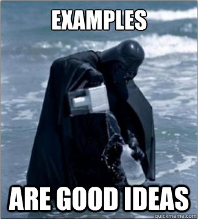

===================
Python code sharing
===================

-------
Summary
-------

+ Python libraries mechanism
    + code structure
    + import mechanism
    + code integration

+ Live quickstart
+ Python packaging steps

---------------------
Python code structure
---------------------

Python code is structured in:

+ modules: one ``.py`` file
+ packages: one directory containing other modules or packages

----------------
Import mechanism
----------------

To be imported, Python code should be in a location listed in ``sys.path``.

By default:

+ the local directory
+ ``/usr/lib/python`` in Linux
+ ``$USER/.local/lib/python`` in Linux (user-space)

``$PYTHONPATH`` may be adjusted to change it.

--------
Builtins
--------

+ No import needed
+ API may change with every major Python release (2.x, 3.x)

::

    % python
    >>> print []

----------------
Standard library
----------------

+ Import needed
+ API may change with every minor Python release (2.6.x, 2.7.x)

::

    % python
    >>> import datetime
    >>> datetime.date

----
PyPI
----

+ Automated installation from *pypi.python.org* with ``easy_install`` or ``pip``
+ API may change anytime

::

    % easy_install numpy
    % python
    >>> import numpy
    >>> numpy.array

--------------
Other packages
--------------

+ Manual download of sources
+ Manual installation with ``easy_install``, ``pip`` or ``setup.py``

::

    % git clone git@somerepository.git
    % cd somerepository
    % python setup.py install --user
    % python
    >>> import somepackage

---------------------------
Packaging 1 - Documentation
---------------------------

+ with code (``doctest``, ...)
+ not with code:
    + ``README`` with short high level tutorials
    + comprehensive API documentation

---------------------------
Packaging 1 - Documentation
---------------------------

-------------------
Packaging 2 - Tests
-------------------

+ unittest
+ integration

---------------------------
Packaging 3 - Packaging (!)
---------------------------

+ ``MANIFEST.in`` defines source package creation rules
    + what files to include in the package

+ ``setup.py`` defines installation rules
    + where to deploy files
    + additional operations

-----------------------
Packaging 4 - Importing
-----------------------

Use ``setup.py`` with:

+ ``dependency_links`` to specify repository
+ ``install_requires`` to specify dependencies

-------------------
Thanks for watching
-------------------

